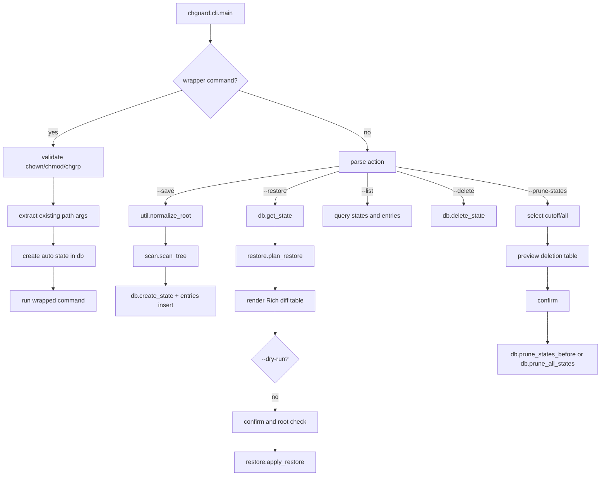

# chguard Development Guide

Interested in the internals of chguard?

This guide describes the current `chguard` codebase for maintainers. It focuses on how the project is organised, what calls what, how filesystem metadata flows into SQLite snapshots, and which invariants matter when changing the code.

---

## 1. What chguard does

`chguard` is a safety-first command-line tool for snapshotting and restoring filesystem ownership and permission metadata.

Its core pipeline is:

```text
Filesystem tree
  |
  | chguard --save PATH --name NAME
  v
SQLite snapshot
  states: snapshot metadata
  entries: relative path, type, mode, uid, gid
  |
  | chguard --restore NAME [--dry-run] [--yes]
  v
Restore plan
  preview owner/mode differences
  apply chmod/chown only after confirmation
```

`chguard` deliberately does not track file contents, hashes, ACLs, extended attributes, deleted files, or new files. It only records enough state to compare and restore:

```text
relative path
entry type: file | dir | symlink
permission bits
numeric uid
numeric gid
```

Wrapper mode adds one more flow:

```text
chguard -- chown|chmod|chgrp ... PATH...
  -> discover existing path arguments
  -> save an automatic pre-command snapshot
  -> run the wrapped command
  -> exit with the wrapped command's return code
```

Wrapper mode is intentionally limited to `chown`, `chmod`, and `chgrp`. Other commands are rejected because chguard only protects ownership and permission metadata.

---

## 2. Repository layout

The project is a single Python package under `chguard/`.

```text
chguard/
  __init__.py              package marker
  cli.py                   argparse CLI, user interaction, Rich output, dispatch
  db.py                    SQLite path, schema creation, state CRUD helpers
  scan.py                  filesystem tree scan into Entry objects
  restore.py               restore planning and chmod/chown application
  util.py                  small path normalisation helper

pyproject.toml             Poetry package metadata and console script
poetry.lock                locked dependency graph
README.md                  user-facing documentation
.pre-commit-config.yaml    Black and generic pre-commit hooks
.gitea/workflows/          lint, dependency audit, SBOM and Grype workflows
dist/                      built release artifacts, not source
```

The installed command is configured in `pyproject.toml`:

```toml
[tool.poetry.scripts]
chguard = "chguard.cli:main"
```

There is no `chguard/__main__.py` at the time of writing, so `python -m chguard` is not the supported entry point. Use the installed `chguard` command or `poetry run chguard` during development.

---

## 3. Main runtime flows

### 3.1 CLI entry flow

All user-facing behaviour enters through `chguard.cli.main()`.

```text
chguard command
  -> chguard.cli.main()
     -> split wrapper command after --, if present
     -> build argparse parser
     -> install argcomplete hooks
     -> parse arguments
     -> open/init SQLite database
     -> dispatch to wrapper, prune, list, delete, save, or restore branch
```

The top-level mutually exclusive actions are:

```text
--save PATH       snapshot a path under a required --name
--restore STATE   preview and optionally apply a saved state
--list            list saved states
--delete STATE    delete one saved state
--prune-states    delete states older than an age, or all states
wrapper mode      chguard -- chown|chmod|chgrp ...
```

`cli.py` currently owns both orchestration and most presentation logic. The narrower modules should stay narrow:

```text
db.py       owns persistence helpers and schema setup
scan.py     owns filesystem metadata scanning
restore.py  owns compare/apply semantics
util.py     owns shared small helpers
```

If a change is not about command-line parsing, confirmation, or display, prefer keeping it out of `cli.py`.

### 3.2 Subcommand call graph



Important dependency direction:

```text
cli.py
  depends on db.py, scan.py, restore.py, util.py, Rich, argcomplete

scan.py
  depends on pathlib, os.walk, lstat/stat only

restore.py
  depends on pathlib, lstat/stat, os.chown, os.chmod only

db.py
  depends on sqlite3 and platformdirs
```

---

## 4. Snapshot storage

Snapshots are stored in a local SQLite database.

Default path:

```text
platformdirs.user_data_dir("chguard")/states.db
```

Users can override the database with:

```bash
chguard --db /path/to/states.db ...
```

### 4.1 Database schema

The schema is created by `db.init_db()`.

```sql
CREATE TABLE IF NOT EXISTS states (
    id INTEGER PRIMARY KEY,
    name TEXT UNIQUE NOT NULL,
    root_path TEXT NOT NULL,
    created_at TEXT NOT NULL,
    created_by_uid INTEGER NOT NULL
);

CREATE TABLE IF NOT EXISTS entries (
    state_id INTEGER NOT NULL,
    path TEXT NOT NULL,
    type TEXT NOT NULL,
    mode INTEGER NOT NULL,
    uid INTEGER NOT NULL,
    gid INTEGER NOT NULL,
    PRIMARY KEY (state_id, path),
    FOREIGN KEY (state_id) REFERENCES states(id) ON DELETE CASCADE
);
```

The primary key on `(state_id, path)` means one snapshot cannot contain duplicate relative paths. Wrapper mode also keeps an in-memory `seen_paths` set to avoid duplicate inserts when a command names overlapping paths such as `foo` and `foo/bar`.

### 4.2 Stored values

`entries.path` is relative to `states.root_path`. The root itself is stored as the empty string `""`.

`entries.mode` stores permission bits only, using `stat.S_IMODE()`. It does not store file type bits.

`entries.uid` and `entries.gid` are numeric. User and group names are resolved only for restore preview display in `cli.py`.

`entries.type` can be:

```text
dir
file
symlink
```

Special files such as devices, sockets, and FIFOs are skipped by `scan.py` and wrapper-mode entry collection.

---

## 5. Data objects

The codebase uses a small set of dataclasses rather than a large domain model.

| Dataclass | File | Purpose |
|---|---|---|
| `db.State` | `db.py` | One row from `states`, used by restore. |
| `scan.Entry` | `scan.py` | One scanned filesystem item relative to a snapshot root. |
| `restore.PlannedChange` | `restore.py` | One restore comparison result, such as mode drift, owner drift, missing path, or type mismatch. |

The tuple shape passed from SQLite to restore functions is:

```python
(path: str, type: str, mode: int, uid: int, gid: int)
```

Keep this shape stable or change both `cli.py` and `restore.py` together.

---

## 6. Saving snapshots

The save entry point is the `--save` branch in `cli.main()`.

```text
--save PATH --name NAME
  -> normalize_root(PATH)
  -> reject existing NAME unless --overwrite
  -> create states row
  -> scan_tree(root, excludes=args.exclude)
  -> refuse if a captured entry is root-owned and current process is not root
  -> insert entries rows
```

`util.normalize_root()` expands `~` and resolves the path:

```python
Path(path).expanduser().resolve()
```

`scan.scan_tree()` uses `lstat()` and `os.walk(..., followlinks=False)`. It does not follow symlinks while scanning. It records regular files, directories, and symlinks, and skips special files.

### 6.1 Excludes

`--exclude` is implemented by `scan._is_excluded()` as simple relative prefix matching.

Examples:

```text
--exclude cache      skips cache and cache/...
--exclude var/tmp    skips var/tmp and var/tmp/...
```

Excludes are not globs or regular expressions. They are stripped of leading and trailing slashes before comparison.

### 6.2 Transaction behaviour

Save runs inside `with conn:`. If scanning finds a root-owned entry while the process is not root, `SystemExit` interrupts the transaction and sqlite3 rolls it back. This prevents partially saved states for the normal save flow.

---

## 7. Wrapper mode

Wrapper mode is detected before argparse parses normal options. Everything after the first `--` is treated as the wrapped command.

```bash
chguard -- chmod 755 file
chguard -- chown user:group file
chguard -- chgrp staff file
```

Supported commands are checked by basename only:

```text
chown
chmod
chgrp
```

The wrapper snapshot flow is:

```text
wrapper_cmd
  -> _extract_paths_from_command()
  -> _common_snapshot_root()
   -> create a unique auto-YYYYMMDD-HHMMSS[-N] state
  -> _iter_entries_for_target() for each path
  -> insert each relative path once
  -> run subprocess.run(wrapper_cmd)
  -> exit with subprocess return code
```

### 7.1 Path extraction limits

`_extract_paths_from_command()` is intentionally simple. It treats any existing non-option argument as a path and skips arguments starting with `-`.

This works for common forms such as:

```bash
chguard -- chmod 644 file
chguard -- chown user:group file1 file2
```

It is not a full parser for every `chmod`, `chown`, or `chgrp` option. Be careful when adding wrapper support for options that take path-like values or when supporting more commands.

### 7.2 Snapshot root selection

For one path, `_common_snapshot_root()` uses that path. For multiple paths, it uses `os.path.commonpath()` across resolved paths.

That means one auto snapshot can cover commands such as:

```bash
chguard -- chmod 700 foo1 foo2
```

without creating multiple entries with the empty relative path.

### 7.3 Empty path list

If no existing path arguments are found, wrapper mode does not create a snapshot. It still runs the wrapped command and returns the wrapped command's exit code.

---

## 8. Restore planning and application

Restore is split into two phases:

```text
restore.plan_restore()   compare current filesystem to saved rows
restore.apply_restore()  apply selected chmod/chown operations
```

The CLI uses `plan_restore()` first, renders a Rich table, then applies only after confirmation unless `--dry-run` is set.

### 8.1 Restore target root

By default, restore targets the original `states.root_path`.

Users can override it with:

```bash
chguard --restore NAME --root /alternate/root
```

The override is normalised with `normalize_root()` before use. Stored relative paths are appended to the target root.

### 8.2 Scope flags

Restore scope is selected in `cli.py`:

```text
default                 restore permissions and ownership
--permissions           restore permission bits only
--owner                 restore uid/gid only
--permissions --owner   argparse allows both; behaviour is both
```

The CLI computes two booleans and passes them to both planning and apply:

```python
restore_permissions
restore_owner
```

### 8.3 Planned change types

`restore.plan_restore()` can produce these `PlannedChange.kind` values:

```text
mode      current permission bits differ from saved mode
owner     current uid/gid differ from saved uid/gid
missing   saved path does not currently exist
type      current path type differs from saved type
```

The CLI restore table displays applicable `mode` and `owner` changes, plus non-applicable `missing` and `type` drift in a `Skipped` column. Missing paths and type mismatches are previewed for operator visibility but are never created, deleted, replaced, or otherwise repaired by restore.

### 8.4 Applying changes

`restore.apply_restore()` re-checks each path with `lstat()` before applying. It skips missing paths, special files, and type mismatches.

When enabled by scope flags, it runs:

```python
os.chown(path, want_uid, want_gid, follow_symlinks=False)
os.chmod(path, want_mode, follow_symlinks=False)
```

`PermissionError` and `NotImplementedError` are swallowed in `apply_restore()`. The CLI tries to catch obvious privilege problems before apply, but apply remains best-effort for platform differences such as chmod on symlinks.

---

## 9. Safety and privilege model

Important product boundaries:

```text
chguard never creates files during restore
chguard never deletes files during restore
chguard never moves or renames files
chguard never changes file contents
chguard never escalates privileges automatically
```

### 9.1 Root-owned files during save

Both normal save and wrapper snapshot creation refuse to save a root-owned entry when the process effective uid is not root.

Normal save error:

```text
This path contains root-owned files.
Saving this state requires sudo.
```

Wrapper mode error:

```text
This command affects root-owned files.
Please re-run with sudo.
```

### 9.2 Root requirement during restore

Restore preview and dry-run do not require root.

Before applying, `cli.py` marks the operation as needing root when a changed path is not owned by the current effective uid. If root is needed and the process is not root, the CLI exits before confirmation and apply.

This is intentionally conservative around ownership and mode changes. Do not add automatic sudo execution.

### 9.3 Confirmation

Destructive or mutating operations require explicit confirmation unless `--yes` is provided:

```text
restore apply
prune states
```

If stdin is not a TTY and `--yes` is not provided, `_confirm_or_abort()` refuses to continue.

### 9.4 Symlinks

The implementation uses `lstat()` and `follow_symlinks=False`, so it does not follow symlink targets while scanning or restoring.

Current code can record symlink entries with type `symlink`. Ownership restore is attempted with `os.chown(..., follow_symlinks=False)`. Permission restore is attempted with `os.chmod(..., follow_symlinks=False)` and ignored if the platform does not support it.

The README currently describes symbolic links as skipped entirely. Treat this as a documentation/behaviour point to resolve carefully before making symlink-related changes.

---

## 10. Listing, deleting, and pruning states

### 10.1 Listing

`--list` queries all states newest-first and displays:

```text
State
Snapshot root
Captured paths
Created
```

`_captured_paths_summary()` displays `directory tree`, `file`, or `symlink` when the snapshot contains a root entry. Otherwise it shows up to five top-level captured relative paths.

Auto snapshots with names starting `auto-` are highlighted in bright cyan.

### 10.2 Deleting one state

`--delete STATE` calls `db.delete_state()`. The `entries` rows are removed by `ON DELETE CASCADE`.

There is currently no confirmation prompt for deleting one named state.

### 10.3 Pruning states

`--prune-states` supports three forms:

```bash
chguard --prune-states=14
chguard --prune-states=all
CHGUARD_STATES_LIFE=30 chguard --prune-states
```

Parsing lives in `_parse_prune_states_value()`.

`--dry-run` previews matching states without deleting. Without `--dry-run`, pruning requires confirmation or `--yes`.

The default age environment variable is:

```text
CHGUARD_STATES_LIFE
```

---

## 11. Display and completion helpers

`cli.py` uses Rich for tables and colourised status output.

Important display helpers:

```text
_uid_to_name()
_gid_to_name()
_format_owner()
_mode_to_rwx()
_captured_paths_summary()
```

User/group name lookup falls back to numeric ids when the uid/gid does not exist on the current host.

Shell completion uses `argcomplete`. `complete_state_names()` opens the configured database and completes names from the `states` table. It catches all exceptions and returns an empty list so completion failures do not break normal shell use.

---

## 12. Development commands

Install dependencies:

```bash
poetry install
```

Run the CLI in the development environment:

```bash
poetry run chguard --help
```

Run pre-commit hooks:

```bash
poetry run pre-commit run --all-files
```

Run the pytest suite:

```bash
poetry run pytest
```

Build release artifacts:

```bash
poetry build
```

The checked-in test suite uses pytest under `tests/`. When adding behaviour, add focused tests rather than relying only on manual CLI checks.

---

## 13. Automation and security scanning

Gitea pull request workflow:

```text
.gitea/workflows/lint-and-security.yml
  -> install pre-commit
  -> pre-commit run --all-files
  -> poetry export dependencies
  -> pip-audit dependency audit
```

Scheduled/manual security workflow:

```text
.gitea/workflows/security-scan.yml
  -> install verified Cosign, Syft, and Grype
  -> generate SBOM
  -> scan for vulnerabilities
  -> notify Node-RED on fixable Medium/High/Critical vulnerabilities
  -> fail workflow on those vulnerabilities
```

Pre-commit currently includes Bandit, Black, trailing whitespace, EOF, YAML, and TOML checks.

---

## 14. Common maintenance tasks

### 14.1 Add a new CLI option

1. Add the argparse option in `cli.py`.
2. Decide whether it affects save, restore, wrapper mode, pruning, or display.
3. Keep persistence changes in `db.py` if schema or state lookup changes.
4. Keep scanning changes in `scan.py` if filesystem enumeration changes.
5. Keep apply semantics in `restore.py` if restore comparison or mutation changes.
6. Update README usage examples.
7. Add tests for parser behaviour and the affected operation.

### 14.2 Change the database schema

1. Update `db.init_db()`.
2. Decide whether old databases must be migrated.
3. Update `db.State` or add new dataclasses as needed.
4. Update all SQL in `cli.py` and `db.py` that reads or writes affected columns.
5. Add tests using a temporary database file.

There is currently no migration system. Do not silently make schema changes that break existing user databases unless the project intentionally accepts that compatibility break.

### 14.3 Change scan behaviour

Start with `scan.py`.

Preserve these invariants unless intentionally redesigning the tool:

```text
use lstat rather than stat
do not follow symlinks
store relative paths under one snapshot root
store the root entry as the empty string
skip special files unless restore semantics are also designed
keep excludes predictable and documented
```

If changing excludes from prefix matching to glob or regex matching, preserve simple prefix behaviour or document the compatibility break.

### 14.4 Change restore behaviour

Start with `restore.plan_restore()` for comparisons and `restore.apply_restore()` for mutation.

Keep planning and application separate. The CLI depends on being able to preview before mutating.

Do not make restore create missing files, delete new files, replace mismatched types, or modify file contents without a deliberate product redesign.

### 14.5 Change wrapper mode

Start with these helpers in `cli.py`:

```text
_extract_paths_from_command()
_common_snapshot_root()
_iter_entries_for_target()
```

Adding more wrapped commands requires understanding whether they only mutate ownership/permissions. Do not wrap commands that can create, delete, rename, or rewrite file contents unless the tool's scope changes.

### 14.6 Add tests

Good first test areas:

```text
scan_tree records root, dirs, files, symlinks, and excludes
plan_restore reports mode, owner, missing, and type changes
apply_restore skips missing/type mismatches
db.init_db creates schema and cascade delete works
prune age parsing handles integer, all, env, invalid values
wrapper path extraction handles common chmod/chown/chgrp shapes
CLI restore dry-run never applies changes
```

Use temporary directories and temporary SQLite files. Avoid tests that require root unless they are explicitly skipped when not root.

---

## 15. Important maintenance hazards

### 15.1 `cli.py` is doing a lot

`cli.py` currently contains parsing, wrapper mode, database insertion loops, restore table formatting, pruning display, completion, and privilege checks. As features grow, prefer moving domain logic into `scan.py`, `restore.py`, or new focused modules.

### 15.2 Restore preview separates applicable and skipped drift

`plan_restore()` reports owner, mode, missing, and type drift. The CLI displays owner/mode changes as applicable actions and missing/type drift as skipped items. Keep that distinction clear: showing skipped drift is useful, but restore must still not create missing files or replace mismatched paths.

### 15.3 Wrapper parsing is not command-specific

Wrapper mode does not fully parse `chmod`, `chown`, or `chgrp`. It snapshots existing non-option arguments. Any change that broadens wrapper usage should avoid giving users a false sense that every affected path was captured.

### 15.4 Numeric ids are the source of truth

Snapshots store uid/gid numbers. Display names are cosmetic and host-local. Do not make restore depend on resolving user or group names.

### 15.5 Path normalisation affects restore portability

Snapshot roots are resolved absolute paths. `--root` is the mechanism for applying a snapshot somewhere else. Do not change root/path semantics without considering existing databases.

### 15.6 Symlink behaviour needs care

The scanner records symlinks but never follows them. Restore uses no-follow operations where available. Platform differences around symlink chmod/chown are real, so keep user-facing wording precise: symlinks are recorded and handled best-effort without following targets.

### 15.7 Permission errors can be best-effort

The CLI attempts to detect when root is required, but `apply_restore()` still suppresses `PermissionError`. If maintainers need strict failure reporting, change both apply return values and CLI output so users can see partial failures.

### 15.8 Existing user databases matter

The default database is persistent user state. Schema and semantics changes can affect existing saved snapshots, not just new runs.

---

## 16. Troubleshooting guide

### 16.1 `--save` says sudo is required

At least one captured entry has uid `0`, and the current process is not root. Re-run with sudo or narrow the saved path/excludes.

### 16.2 Restore says sudo is required

At least one owner or mode change targets a path not owned by the current effective uid. Preview and `--dry-run` are still available without sudo.

### 16.3 Restore shows skipped items

Missing paths and type mismatches are shown in the restore preview as skipped items. This is expected: chguard reports the drift but does not create missing files or replace paths with the wrong type.

### 16.4 A path was not captured

Check, in order:

1. Does the path exist at snapshot time?
2. Is it under the normalised snapshot root?
3. Was it excluded by `--exclude` prefix matching?
4. Is it a special file such as a socket, FIFO, or device?
5. In wrapper mode, did the argument start with `-` or not exist before the command ran?

### 16.5 Completion does not show state names

Check that argcomplete is installed and registered for the shell, and that `--db` points at the expected database. Completion failures are intentionally silent.

### 16.6 Prune without an age fails

`chguard --prune-states` without a value reads `CHGUARD_STATES_LIFE`. Set the environment variable or pass an explicit value such as `--prune-states=30` or `--prune-states=all`.

---

## 17. Practical code-reading map

| Feature/question | Start with | Then read |
|---|---|---|
| CLI option behaviour | `cli.py:main()` | argparse branch for the action |
| Snapshot schema | `db.py:init_db()` | SQL call sites in `cli.py` |
| Default DB path | `db.py:default_db_path()` | `platformdirs.user_data_dir` docs |
| Save scanning | `scan.py:scan_tree()` | `cli.py` `args.save` branch |
| Exclude behaviour | `scan.py:_is_excluded()` | README usage docs |
| Wrapper snapshots | `cli.py` wrapper branch | `_extract_paths_from_command()` and `_iter_entries_for_target()` |
| Restore comparison | `restore.py:plan_restore()` | CLI restore display loop |
| Restore mutation | `restore.py:apply_restore()` | CLI confirmation/root checks |
| Rich output | `cli.py` table construction | `_format_owner()` and `_mode_to_rwx()` |
| State completion | `cli.py:complete_state_names()` | argcomplete setup |
| Pruning | `_parse_prune_states_value()` | `db.prune_states_before()` and `db.prune_all_states()` |
| Packaging | `pyproject.toml` | Poetry docs |
| Automation | `.gitea/workflows/` | `.pre-commit-config.yaml` |

---

## 18. Glossary

**State**
A named snapshot row in the `states` table.

**Entry**
A captured file, directory, or symlink metadata row in the `entries` table.

**Snapshot root**
The absolute root path saved in `states.root_path`. Entry paths are relative to this root.

**Root entry**
The metadata entry for the snapshot root itself. It is stored with `entries.path = ""`.

**Restore plan**
The list of `PlannedChange` objects produced before any mutation occurs.

**Wrapper mode**
The `chguard -- chmod|chown|chgrp ...` mode that saves an automatic pre-command snapshot before running the command.

**Auto snapshot**
A wrapper-created state named like `auto-YYYYMMDD-HHMMSS`, with a numeric
suffix when needed to keep same-second snapshots unique.

**Owner restore**
Restoring numeric uid/gid with `os.chown(..., follow_symlinks=False)`.

**Permission restore**
Restoring permission bits with `os.chmod(..., follow_symlinks=False)`.

---

## 19. Final maintenance model

Most changes should preserve this model:

```text
Scan metadata without following symlinks
  -> store target-neutral numeric ownership and mode in SQLite
  -> preview differences before applying
  -> apply only selected chmod/chown operations
  -> never create, delete, move, or rewrite files
```

Before changing code, ask:

1. Is this a CLI concern, scan concern, persistence concern, or restore concern?
2. Does the SQLite schema need to change, and what happens to existing databases?
3. Does this preserve the no-content/no-create/no-delete scope?
4. Does wrapper mode still snapshot every path it claims to protect?
5. Does the restore preview still happen before mutation?
6. Does the change behave safely without root?
7. Are symlink and special-file behaviours explicit?
8. Do README examples and shell completion still match the command surface?
9. Are there focused tests for the edge case being changed?

Keeping those boundaries clear is the main way to maintain chguard without turning a narrow metadata guardrail into a misleading general-purpose undo tool.
